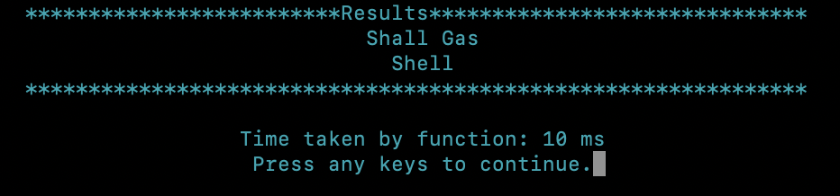
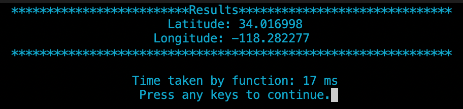
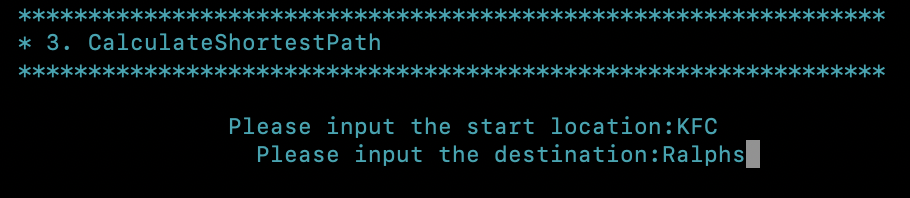
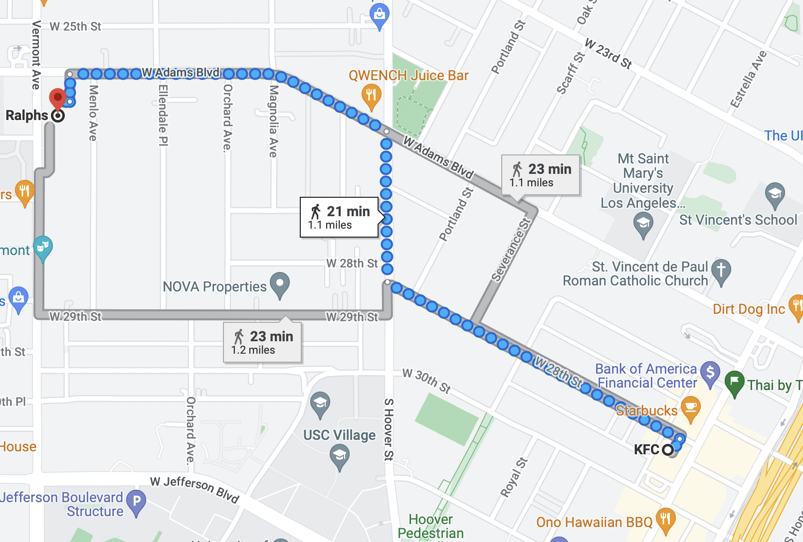

## TrojanMap

## Link to Video Presentation: 
https://youtu.be/WStFstsgG_E
## Link to Powerpoint Presentation:
https://docs.google.com/presentation/d/1HYIfkST17boO1FFruYaFNyJvCGa_y2mARwRocF2WULA/edit?usp=sharing

This project focuses on using data structures in C++ and implementing various graph algorithms to build a map application.

Trojan Map is similar to that of the google maps but limited to the area around University of Southern California.

## The Data Structure

Each point on the map is represented by the class **Node** shown below and defined in [trojanmap.h](src/lib/trojanmap.h).

<p align="center"></p>

## UI

The UI was implemented using ncurses.
<p align="center"></p>


## Pre-requisites Installation

The below packages and libraries were installed on the Ubuntu Operating System:
- cmake
- OpenCV
- ncurses

## Functions 

## 1. Autocomplete

- Function:

    ```c++
    std::vector<std::string> Autocomplete(std::string name);
    ```

- Description:  
  -  A function was implemented to enter the partial name of the location and obtain possible list of locations with partial name as prefix. 
  -  The input string was converted to lower case and was filtered for non-alphabet characters.
  -   Substring operation was used to compare the entered prefix string and obtain all the strings starting with the entered prefix.
  -   Example:
        Input: "Sh", Output: ["Shall Gas", "Shell"]

        <p align="center"></p>

        <p align="center"></p>

- Time Complexity:
The time complexity of this function is O(n), where n is the total number of nodes. 

- Runtime:
On a MacBook Pro laptop with M1 processor, it takes 10 ms to search for "Sh".

## 2. Find Position

- Functions:

  - GetPosition:
    
    ```c++
    std::pair<double, double> GetPosition(std::string name);
    ```

    - Traverse all nodes in the given data until we find the input name.
    - If the name is found, record its latitude and longitude using GetLat() and GetLon(). Else we ouput (-1, -1).
    - Time Complexity: O(n), where n is the number of nodes in the give map.

  - GetLat:
  
    ```c++
    double GetLat(std::string id);
    ```
    Given location's id, return its latitude.

    Time Complexity: O(1)
  - GetLon:
    ```c++
    double GetLon(std::string id);
    ```
    Given location's id, return its longitude.

    Time Complexity: O(1)

- Description:
  - The user enters the full name of a location and the program returns the latitude and longitude as the output on the terminal, and also marks the given locations on the popup map window. 
  - There are no duplicated location names stored in the map. 
  - If the location does not exist, then a closest location name is suggested and marked on the map.

  -   Example:
      Input: "Chipotle", Output: (34.016998, -118.282277)

      <p align="center"></p>
      <p align="center"></p>
      <p align="center"></p>

      Input: "Rolph"

      <p align="center"></p>
      <p align="center"></p>
      <p align="center"></p>

- Time Complexity: O(n)

- Runtime:
On a MacBook Pro laptop with M1 processor, it takes 17 ms to search for "Chipotle".


## 3. Calculate Shortest Path Between Two Places

- Functions:
  - Dijkstra
    ```c++
    std::vector<std::string> CalculateShortestPath_Dijkstra(std::string &location1_name,std::string &location2_name);
    ```
    - Implemented using priority queue by visiting all the unvisited nodes and calculating shortest distance of the unvisited node N from the starting node
    - While going from the unvisited node N to another node further in the graph, it updates the neighbours.
    - If the distance is shorter than the previous path then the updated node is pushed to the priority queue
    - Priority queue stores the distance value for every node using the concept of minHeap.
    - If a path does not exist it will return an empty vector.
    - Time Complexity: O(mlog(n)), where n is the number of nodes and m is the number of edges.
  
  - Bellman_Ford
    ```c++
    std::vector<std::string> CalculateShortestPath_Bellman_Ford(std::string &location1_name,std::string &location2_name);
    ```
    - Finds the shortest paths between two location by adding one edge at a time while finding path from a node to the starting node.
    - It follows early termination that is the algorithm will stop when there is no changes or updates in the path.
    - Time Complexity: O(n + m), where n is the number of nodes, m is the number of edges in the given map.

  - GetNeighborIDs
    ```c++
    std::vector<std::string> GetNeighborIDs(std::string id);
    ```
    Given the location's name, return its neighbors.
    Time Complexity: O(1).

- Description:
  - User types in two locations A and B, the program returns the best route from A to B and shows the path on the map window. 
  - User can choose to use Dijkstra algorithm or Bellman-Ford algorithm. If there is no path, it returns an empty vector.

- Time Complexity:
    - For Dijkstra: O(mlog(n)), where m is the total number of edges in the map and n is the total number of nodes.
    - For Bellman-Ford: O(n*m), where m is the total number of edges in the map and n is the total number of nodes.

- Example:
    Input: "KFC","Ralphs"

    <p align="center"></p>
    <p align="center"></p>
    <p align="center"></p>
    <p align="center"></p> 

- Dijkstra vs Bellman Ford
  <p align="center"></p> 

- Runtime:
   On a MacBook Pro laptop with M1 processor
    -  Dijkstra takes 109 ms to search for the shortest path from KFC to Ralphs.
    - Bellman-Ford takes 10962 ms to search for the shortest path from KFC to Ralphs.

## 4. Travelling Trojan (TSP)

- Functions:
    - TravellingTrojan_helper
        ```c++
        void TravellingTrojan_helper(std::vector<std::string> &location_ids,std::vector<std::vector<double>> &weights,std::vector<std::vector<std::string>> &path,double &minDist, std::vector<int> &currentPath,double currDist,std::unordered_set<int> &seen, bool is_bruteforce)
        ```
        DFS algorithm to find the minimum cost given the start location.
        Time Complexity: O(n!), where n is the number of locations.

    - TravellingTrojan_Brute_force
        ```c++
        std::pair<double, std::vector<std::vector<std::string>>> TravellingTrojan_Brute_force(std::vector<std::string> &location_ids);
        ```
        - Description: Generates permutation and combination of each pair of nodes and returns the shortest route covering all the locations and returning back to the starting node.
        - Time Complexity: O(n!), where n is the number of nodes in the input.
        - Runtime: 702 ms
        
        <p align="center"></p> 
    
    - TravellingTrojan_Backtracking
        ```c++
        std::pair<double, std::vector<std::vector<std::string>>> TravellingTrojan_Backtracking(std::vector<std::string> location_ids);
        ```
        - Description: 
          - Enhances the implementation with early backtracking as compared to the brute force approach.
          - Compares the distance of two nodes larger than the shortest route, the algorithm stops and checks for the next route.
        - Time Complexity: O(n!), where n is the number of nodes in the input.
        - Runtime: 127 ms
        
        <p align="center"></p> 

    - TravellingTrojan_2opt
        ```c++
        std::pair<double, std::vector<std::vector<std::string>>> TravellingTrojan_2opt(std::vector<std::string> &location_ids);
        ```
        - Description: 
          - 2-OPT is a simple local search algorithm for solving the traveling salesman problem.
          - Main idea is taking a route that crosses over itself and reorder it in a way such that we do not obtain any crossovers in the route.
          - It reverses the path between two points if the route is shorter compared to the previous one.
        - Time Complexity:O(n^2), where n is the number of locations.
        - Runtime: 3 ms
        <p align="center"></p> 
    - Output
    <p align="center"></p> 
    - Comparision
    <p align="center"></p> 
    <p align="center"></p> 

## 5. Cycle Detection

- Functions:
    ```c++
    bool CycleDetection(std::vector<std::string> &subgraph, std::vector<double> &square);
    ```

    ```c++
    bool hasCycle(std::string current_id, std::map<std::string, bool> &visited, std::string parent_id, std::vector<double> &square, std::map<std::string, std::string>& predecessor);
    ```

- Description:
  - The objective is to detect if any cycles are present in the defined square graph using the input latitude and longitude coordinates of the locations.
  - Functionality implemented using DFS algorithm and unordered map.
  - The algorithms iterates over the region defined by the input coordinates and checks if the node is seen or visited and iteratively checks for any cycles detected within that region.

- Examples:
  - Example 1
    <p align="center"></p> 
    <p align="center"></p> 
    <p align="center"></p> 
  - Example 2
    <p align="center"></p> 
    <p align="center"></p>
    <p align="center"></p>  

- Time Complexity:
The time complexity of this function is O(n + m), where m is the total number of edges in the given region and n is the total number of nodes in the map.

- Runtime:
On a MacBook Pro laptop with M1 processor, the function takes 10 ms for Example 1 and 0 ms for Example 2.

## 6. Topological Sort

- Functions:

    ```c++
    void TopologicalSort_helper(std::string &loc, std::unordered_map<std::string, std::vector<std::string>> &dependency, std::unordered_map<std::string, bool> &visited, std::vector<std::string> &res);
    ```
    ```c++
    std::vector<std::string> DeliveringTrojan(std::vector<std::string> &locations, std::vector<std::vector<std::string>> &dependencies);
    ```

- Description:
    - The input is a set of locations and corresponding dependencies and the output is a topological sorted path which can be visualized on the map.
    - It is implemented using DFS algorithm.
    - It will plot each location name and directed edges to demonstrate a feasible route.

- Examples:
    <p align="center"></p> 
    <p align="center"></p> 
    <p align="center"></p> 

- Time Complexity:
The time complexity of this function is O(n + m), where m is the total number of edges in the given files and n is the total number of nodes in the given files.

- Runtime:
On a MacBook Pro laptop with M1 processor, the function takes 0 ms to search for the input files.

## 7. Find Nearby

- Function:
    ```c++
    std::vector<std::string> TrojanMap::FindNearby(std::string attributesName, std::string name, double r, int k);
    ```
- Description:
  - Returns a list of locations based on the attributes and the nearby input location within a particular radius from the input location.
  - The output locations are ordered from nearest to farthest order.

- Examples:
    <p align="center"></p> 
    <p align="center"></p> 
    <p align="center"></p> 

- Time Complexity: 
The time complexity of this function is O(mn), where n is the total number of nodes given.

- Runtime:
On a MacBook Pro laptop with M1 processor, the function takes 5 ms.

## Runtime of all implemented functionalities

Autocomplete:                   O(n)

Finding the Position:           O(n)

Calculate the Shortest Path: 

Dijkstra:                       O(n^2)

Bellman Ford:                   O(n*m)

Travelling Trojan (TSP)

Brute Force:                    O(n!)

Backtracking:                   O(n!)

2 - Opt:                        O(n^2)

Cycle Detection:                O(n+m)

Topological Sort:               O(n+m)

Find Nearby:                    O(n^2)

where, n: Number of nodes in the map, m: Number of edges in the map

## Conclusion: 

- This project provided an opportunity to learn and practice many important data structures and graph algorithms in software programming, including DFS, Bellman Ford, Dijkstra and recursive algorithms.

- Usage of different data structures can improve the efficiency of the program while also reducing the runtime.

- The future scope of this project:
  - Add separate routes for driving, public transit, walking, ride sharing, cycling, or motorcycle.
  - Implementing 3-opt approach for the Travelling Salesperson problem
  - Broadening the scope of the map to cover a larger geographical area
  - Improving the efficiency of the implemented algorithms